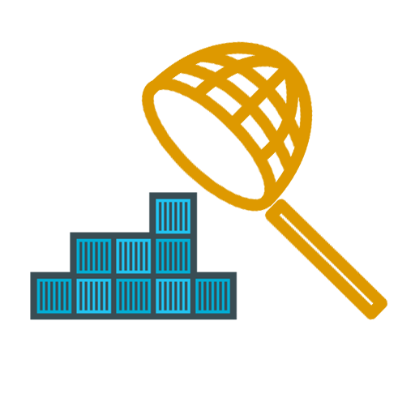

# GateNet CNI Plugin

GateNet is a custom networking plugin built according to the [CNI specifications](https://github.com/containernetworking/cni/). It enables the placement of a gateway firewall into a container cluster. By deploying an overlay network on top of the orchestrator network frame, it ensures that all east-west traffic (pod-to-pod communication) is routed through the designated gateway.

The goal of this project is to secure container clusters from possible internal treats. GateNet is an east-west firewall that is highly available and supports scaling. It is not to replace internet facing north-south firewalls and will best work in combination with one.

**Disclaimer**: While this projects works well in practice, there are some optimizations that need to be done before moving it into a production environment. Please read the [Further Improvements](#further-improvements) section below.

## Getting Started

1. Deploy a new k8s cluster to Azure by following the [guide on the acs-engine repo](https://github.com/Azure/acs-engine/blob/master/docs/acsengine.md). You can instead use the [Azure CLI](https://docs.microsoft.com/en-us/azure/container-service/kubernetes/container-service-kubernetes-walkthrough) for simplicity if you don't need the latest release of k8s.

2. Make sure that you don't have any k8s objects deployed. Copy over the [node provisioning script](scripts/node_install.sh) to every node in the cluster and run it with `sudo ./node_install.sh`. This will do the following:  
    * tell kubelet to use CNI plugins (instead of kubenet) for pod initialization
    * fetch and install the default configuration file into `/etc/cni/net.d`
    * fetch and install the required CNI binaries (v 0.3) into `/opt/cni/bin`
    * load the necessary kernel modules
    * restart kubelet to make the changes take effect 

3. Edit the GateNet configuration found in `/etc/cni/net.d/10-gatenet.conf`

4. Download the `.yaml` files found in the [demo cluster directory](demo-cluster/) and deploy them using `kubectl apply -f <fileName>`

5. Run `kubectl get pods` and `kubectl get all -n gatenet` to see the k8s objects you deployed. You can now SSH into the pods using `kubectl exec -it [-n gatenet] <podName> /bin/bash` and run pings commands to test our your deployment.

6. Success, you now have an east-west firewall! Create your own firewall container image based off of the provided one to specify your own firewall rules.

## Word Soup

| Abbreviation | Explanation |
| :--- | :--- |
| k8s | kubernetes |
| kubelet | The kubernetes client running on each node/VM in the cluster. |
| kubenet | The default binary used to setup container networking whenever a new pod is created. |
| gatenet | The k8s namespace where firewall pods are deployed. If you change this make sure to update the config. |

## Issues

1. The [node provisioning script](scripts/node_install.sh) cannot set the `unsafe sysctl` flag automatically since there is not support on k8s clusters deployed by acs-engine to edit this flag directly. Currently this has to done manually. Read the comments in the provisioning script for more detail.

## Further Improvements

1. Move the [node provisioning script](scripts/node_install.sh) into [acs-engine](https://github.com/Azure/acs-engine) so that users can simply set a flag in the deployment configuration to enable GateNet.

2. Release the GateNet CNI binary, and the default configuration as a GitHub release for direct downloads. 